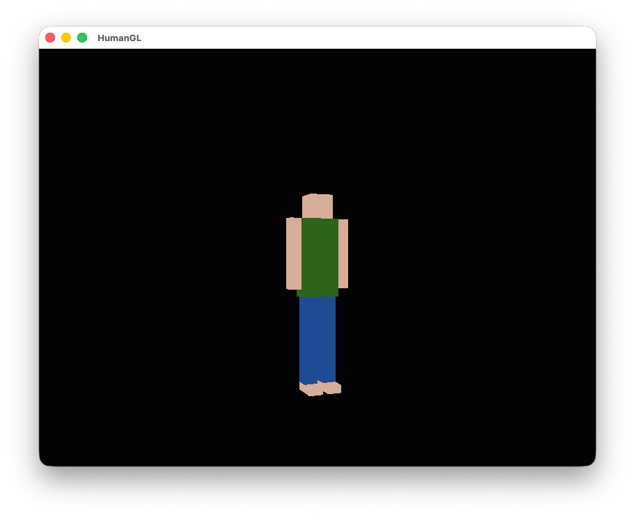
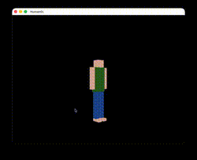

# HumanGL

HumanGL is a C++20 OpenGL/SDL2 demo that renders a hierarchical 3D character and animates it with multiple preset states.

## Preview






## Features

- Hierarchical character model with separate body parts
- Idle, walk, jump, and dance animations
- Mouse-controlled camera rotation and zoom
- Custom matrix stack, transforms, and cube rendering

## Requirements

- A C++20 compiler
- `make`
- SDL2
- GLEW
- OpenGL

## Build

### macOS

```bash
brew install sdl2 glew
make
```

### Linux

Install the SDL2 and GLEW development packages for your distribution, then run:

```bash
make
```

## Run

```bash
make run
```

## Controls

- `1` - Idle
- `2` - Walk
- `3` - Jump
- `4` - Dance
- `Left mouse drag` - Rotate the camera
- `Mouse wheel` - Zoom in and out
- `Esc` - Quit
